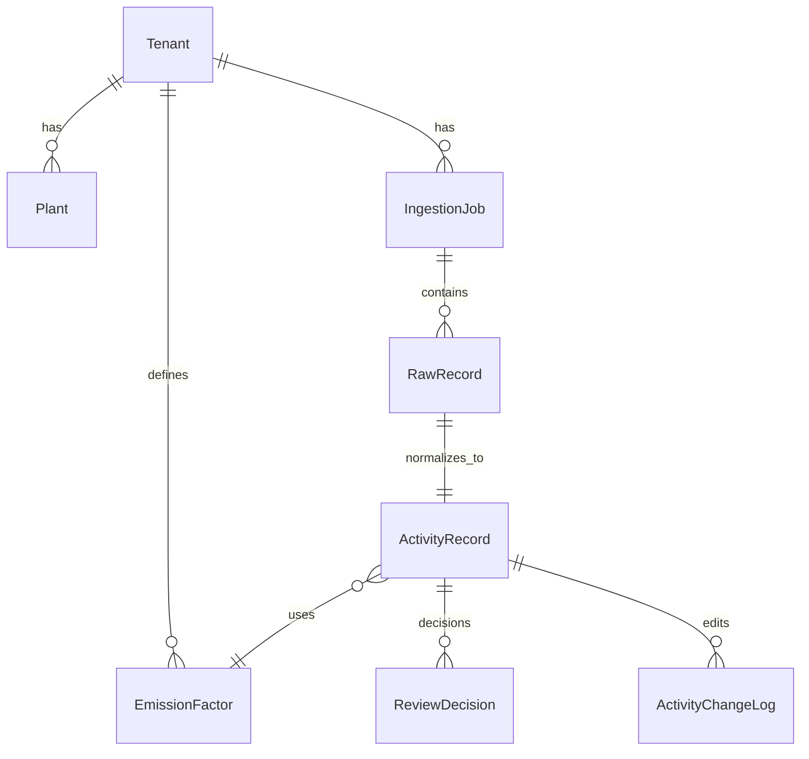

# Data Model (Prototype)

This prototype is built around a **raw → canonical → review/audit** lifecycle.

- **RawRecord** stores the exact source row/event for audit and replay.
- **ActivityRecord** is the canonical, normalized activity row that analysts review.
- **ReviewDecision** + **ActivityChangeLog** capture analyst decisions and edits.

## Core Entities

### Tenant
Represents an enterprise client. Every major table has `tenant_id` for isolation.

### Plant
Represents a facility / plant / cost-center-like unit within a tenant.

- Used to map SAP `Werk` codes and group utility meters.
- `(tenant, code)` is unique.

### IngestionJob
Represents a single upload/import operation.

- Tracks `source_type`, status lifecycle (`received → processing → completed|failed`), and counters.
- Counters are duplicated intentionally for dashboards: `raw_record_count`, `failed_record_count`, `anomaly_record_count`, etc.

### RawRecord
Stores **raw source data exactly as received**.

Key fields:
- `raw_payload` (JSON), `raw_text` (optional original line/blob), `raw_hash_sha256` (integrity).
- `status` + `parse_errors` for failure transparency.

Design intent: normalization creates derived data, but **does not replace** raw input.

### EmissionFactor
Small emission factor catalog.

- `tenant` is nullable: `NULL` indicates a shared/global factor.
- Fields include `scope`, `category`, `subcategory`, `unit`, `co2e_kg_per_unit`, and validity bounds.

### ActivityRecord (Canonical)
The normalized “row” that analytics and reporting build on.

Key concepts:
- **Source fields**: `source_quantity`, `source_unit`, and source identifiers.
- **Normalized fields**: `quantity`, `normalized_unit`.
- **Derived emissions**: `co2e_kg` with a linked `emission_factor`.
- **Factor snapshot**: `emission_factor_snapshot` stores the factor values used at normalization time.
- **Category-specific metadata**: `activity_metadata` JSON (meter IDs, airports, cabin class, etc.).
- **Anomalies/confidence**: `anomaly_flags` and `confidence_score`.

Validation rule:
- an activity is either point-in-time (`activity_date`) **or** period-based (`period_start`/`period_end`), not both.

## Analyst Workflow + Audit

### Review status + locking
`ActivityRecord.review_status` is `pending|approved|rejected`.

- **Pending**: editable via the review edit endpoint.
- **Approved**: prototype behavior locks immediately (`locked_at/locked_by`) to enforce immutability.
- **Rejected**: retained for traceability (not deleted).

### ReviewDecision
Every approve/reject creates a `ReviewDecision` row containing:
- who decided + optional reason
- an immutable `activity_snapshot` of the ActivityRecord at decision time

### ActivityChangeLog
Every edit (and approval/rejection) creates a change log row with:
- `before` / `after` snapshots and `changed_fields`
- actor + optional reason

## Ingestion → Normalization

Each ingestion adapter follows this pattern:
1. Create an `IngestionJob`
2. For each source row/event:
   - create a `RawRecord` (always)
   - if parsable, create an `ActivityRecord` linked 1:1 to the raw record
3. Update `IngestionJob` counters and status

The normalized record stores both the parsed source values and the canonical values to preserve lineage.
